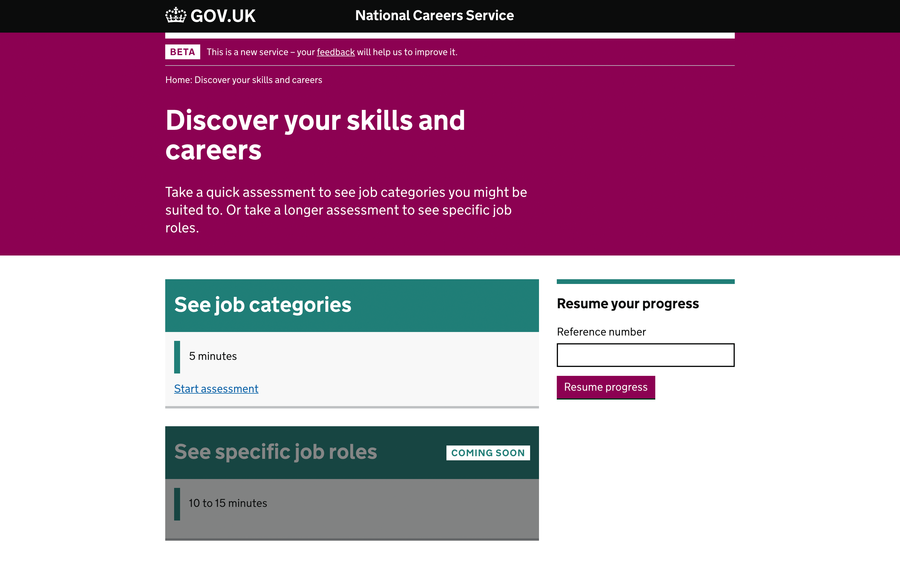
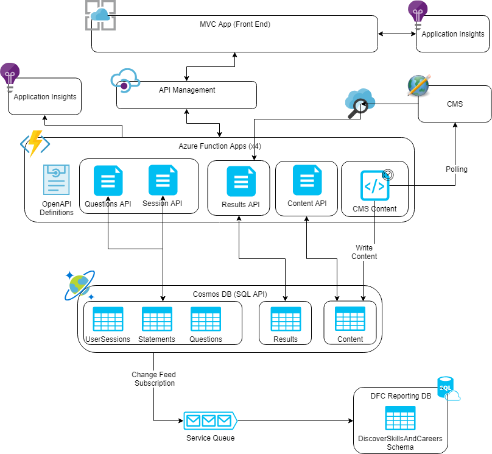
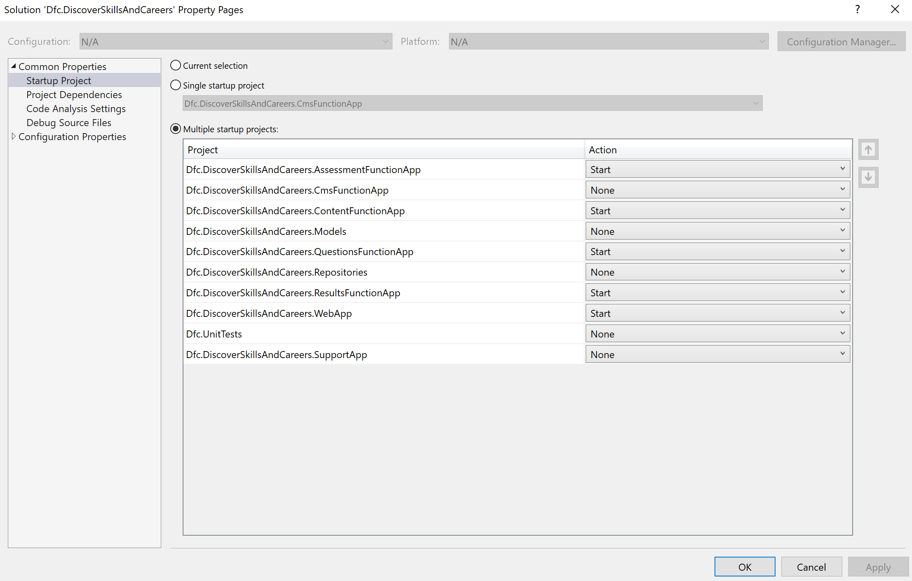

# Discover Skills and Careers

## Screenshots



## Live examples

### DEV

- Web: https://dfcdevskillscareersstr.z6.web.core.windows.net
- Questions: https://dfc-dev-skillscareers-fa.azurewebsites.net/q/1?assessmentType=short

### SIT

- Web: https://dfcsitskillscareersstr.z6.web.core.windows.net
- Questons: https://dfc-sit-skillscareers-fa.azurewebsites.net/q/1?assessmentType=short


## Technical documentation

### Architecture Documents



### Dependencies

* Visual Studio 2017 / Visual Studio Code
* .NET Core 2.1 or higher
* [Azure Functions Tools](https://www.npmjs.com/package/azure-functions-core-tools)
* [Azure Cosmos Emulator](https://docs.microsoft.com/en-us/azure/cosmos-db/local-emulator)
* [Azure Storage Emulator](https://docs.microsoft.com/en-us/azure/storage/common/storage-use-emulator)

### Solution Structure

* **Dfc.DiscoverSkillsAndCareers.ChangeFeed.Triggers** - Subscriptions for the change feed to the underlying Cosmos DB and publishes onto a service bus for consumption by the change feed processor.
* **Dfc.DiscoverSkillsAndCareers.ChangeFeed.Processor** - Subscribes the an azure service bus and processes messages published by the Change feed trigger then stores the data in the given reporting database.
* **Dfc.DiscoverSkillsAndCareers.AssessmentFunctionApp** - Assessment apis for new, move, answer, reload
* **Dfc.DiscoverSkillsAndCareers.CmsFunctionApp** - CMS timer function
* **Dfc.DiscoverSkillsAndCareers.ContentFunctionApp** - Content apis to supply CMS content to pages
* **Dfc.DiscoverSkillsAndCareers.QuestionsFunctionApp** - Question apis to expose question data
* **Dfc.DiscoverSkillsAndCareers.ResultFunctionApp** - Results api to fetch results for a statement
* **Dfc.DiscoverSkillsAndCareers.Models** - Any data models.
* **Dfc.DiscoverSkillsAndCareers.Repositories** - Any data access code that is required
* **Dfc.DiscoverSkillsAndCareers.WebApp** - MCV app.

### Running the application

You will need to complete Prerequisites for Notify https://docs.notifications.service.gov.uk/net.html#net-client-documentation

#### Building and Running the Api Function Apps

Create a local.settings.json file (change as requried but the following works with the Cosmos emulator)
```
{
    "CosmosSettings": {
        "Endpoint": "https://localhost:8081",
        "Key": "C2y6yDjf5/R+ob0N8A7Cgv30VRDJIWEHLM+4QDU5DE2nQ9nDuVTqobD4b8mGGyPMbIZnqyMsEcaGQy67XIw/Jw==",
        "DatabaseName": "TestDatabase"
    },
    "AppSettings": {
        "SessionSalt": "ncs",
        "SiteFinityApiUrlbase": "https://localhost:9091"
    }
}
```

*NOTE:* The `SiteFinityApiUrlbase` only applies to the CMS function application.

To build an api function app navigate to `src/Dfc.DiscoverSkillsAndCareers.AssessmentFunctionApp` and run

    dotnet build

to run the function app again

    func host start

repeat for all apis to run locally.

#### Visual Studio run everything for debug

You can set your startup projects to start all, the apis and the front-end at the same time to debug.



#### Asset Revisioning

Assets are revisioned using [`gulp-rev`](https://github.com/sindresorhus/gulp-rev) and references to those files are updated using [`gulp-rev-rewrite`](https://github.com/TheDancingCode/gulp-rev-rewrite).

Note that these assets are only revisioned when the file is changed, and not every time the task is run.

#### JavaScript

JavaScript is written in ES6 and is compiled using Babel in order to support older browsers.

JavaScript is linted using the [Standard](https://standardjs.com) linter, as documented in the [GOV.UK coding standards and guidelines](https://github.com/alphagov/styleguides/blob/master/js.md#linting)

### Running the test suite

#### Front-end

Generate the front-end files navigate to `src/Dfc.DiscoverSkillsAndCareers.WebApp` and run

    gulp test

#### Building and running the front-end

##### Config of APIs

Navigate to `src/Dfc.DiscoverSkillsAndCareers.WebApp` and edit appsettings.json

For a local run of everything:
```
{
    "Logging": {
        "LogLevel": {
            "Default": "Warning"
        }
    },
    "AllowedHosts": "*",
    "AppSettings": {
        "SessionSalt": "ncs",
        "ContentApiRoot": "http://localhost:7071/api",
        "SessionApiRoot": "http://localhost:7074/api",
        "ResultsApiRoot": "http://localhost:7073/api",
        "AssessmentQuestionSetNames": "short=Draft01&long=long test",
        "UseFilteringQuestions": "true"
    },
    "CosmosSettings": {
        "Endpoint": "https://localhost:8081",
        "Key": "C2y6yDjf5/R+ob0N8A7Cgv30VRDJIWEHLM+4QDU5DE2nQ9nDuVTqobD4b8mGGyPMbIZnqyMsEcaGQy67XIw/Jw==",
        "DatabaseName": "TestDatabase"
    }
}
```

Or to use remote apis:
```
{
    "Logging": {
        "LogLevel": {
            "Default": "Warning"
        }
    },
    "AllowedHosts": "*",
    "AppSettings": {
        "SessionSalt": "ncs",
        "ContentApiRoot": "https://dfc-dev-skillscareers-content-fa.azurewebsites.net/api",
        "SessionApiRoot": "https://dfc-dev-skillscareers-assessments-fa.azurewebsites.net/api",
        "ResultsApiRoot": "https://dfc-dev-skillscareers-results-fa.azurewebsites.net/api",
        "AssessmentQuestionSetNames": "short=201901&long=long test",
        "UseFilteringQuestions": "true"
    }
}
```

To build and run the front-end and run

    dotnet run


#### Linting

Sass linting config is taken from the [`gov-lint`](https://github.com/alphagov/govuk-lint/blob/master/configs/scss_lint/gds-sass-styleguide.yml) project and [converted from the “SCSS Lint” style to “Sass Lint”](http://sasstools.github.io/make-sass-lint-config/) to work with the [`sass-lint`](https://www.npmjs.com/package/sass-lint) module.

#### Cross-browser Testing

Cross-browser testing is carried out using [BrowserStack](https://www.browserstack.com/automate/protractor). BrowserStack testing will run through happy/negative paths and is part of gulp test task. To run manually navigate to `src/web` and run

    gulp browserStack

#### Accessibility Testing

Accessibility testing is carried out using [Pa11y](https://github.com/pa11y/pa11y). WCAG2AA is used as testing standard and is part of gulp test task. To run manually navigate to `src/web` and run

    gulp pa11y

#### Performance Testing

Performance testing is carried out using [Lighthouse](https://github.com/GoogleChrome/lighthouse#readme) and is part of gulp test task. To run manually navigate to `src/web` and run

    gulp lighthousePerformanceTest

## Deployment Structure

There are 9 deployment artifacts

1. **Assessment Api Function** - To be deployed to the api function environment.
2. **CMS Api Function** - To be deployed to the api function environment.
3. **Content Api Function** - To be deployed to the api function environment.
4. **Questions Api Function** - To be deployed to the api function environment.
5. **Resukts Api Function** - To be deployed to the api function environment.
6. **MVC Web App** - To be deployed to the web environment.
7. **Change Feed Database** - To be deployed to the DFC Shared databsae currently used by DSS
8. **Change Feed Trigger** - To be deployed to the api function environment
9. **Change Feed Processor** - To be deployed to the api function environment. 

The support app can be run in order to create the relevant Statement and Content data.

## Analytics

### Event Tracking

HTML Elements

    gov-analytics-data="{{pageName}} | click | button | Start assessment"

Nunjucks partials

    {{ govukButton({
        text: "Resume progress",
        classes: "app-button",
        attributes: {
          "gov-analytics-data": pageName + " | click | button | Resume progress"
        }
      }) }}

## Licence

[MIT Licence](/LICENCE)
